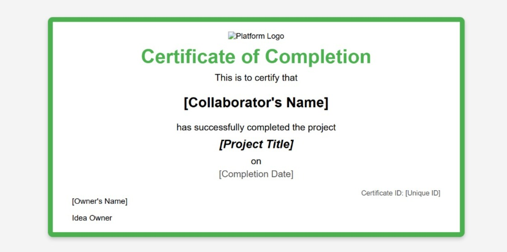

# Aloha 🎯

## Basic Details

### Team Name: Arachnids

### Team Members

- Member 1: V Gopika Unni - GECT
- Member 2: Marrea Treasa Francis - GECT

### Hosted Project Link

[mention your project hosted project link here]

### Project Description

This is basically a website where you can share your ideas which can be patented. People who are interested in working on the project can collaborate and work with the idea owner. Completed projects can be put up for bidding or sale. Users can provide reviews for the ideas.

### The Problem statement

Have an idea but dont know where to start? Wanna give a bit of exposure to your ideas?Then this platform is for you.

### The Solution

Individuals can upload their ideas along with the necessary details.For each unique ideas they recieve patents.Anyone wanting to work on that project can request the idea owner and can work on the project.At the end,the collaborators recieve certificates and the finished projects can if agreed to by the owner be put up for sale.

## Technical Details

### Technologies/Components Used

For Software:

- Languages Used:
  JavaScript: For both frontend (React) and backend (Node.js).

- Frameworks Used:
  React: For building the frontend user interface.
  Node.js: For the backend server to handle API requests.
  Express.js: For setting up the RESTful API routes in the backend.

- Libraries Used:
  Framer Motion: For animations and transitions in the UI.
  React Icons: For adding icons to the project (e.g., FaHeart for likes).
  Mongoose: For interacting with MongoDB as the database.
  Tailwind CSS: For quick and responsive styling.
  dotenv: For managing environment variables securely.
  bcryptjs: For securing the passwords
- Tools Used:
  MongoDB: As the database to store ideas, users, notifications, etc.
  Postman: For testing API endpoints during development.
  VS Code: As the IDE for development.
  Git/GitHub: For version control and collaboration.
  npm: For managing project dependencies.
  Webpack: For bundling React code (depending on your setup).

### Implementation

For Software:

# Installation

[commands]

# Run

npm run dev
node server.js

### Project Documentation

For Software:

# Screenshots (Add at least 3)

Home Page

Ideas Page

Contact Page

User Ideas Page

Certificates generated for collaborators

### Project Demo

# Video

[Add your demo video link here]
<video controls src="Screen Recording 2025-01-26 093428.mp4" title="Title"></video>

---

Made with ❤️ at TinkerHub
